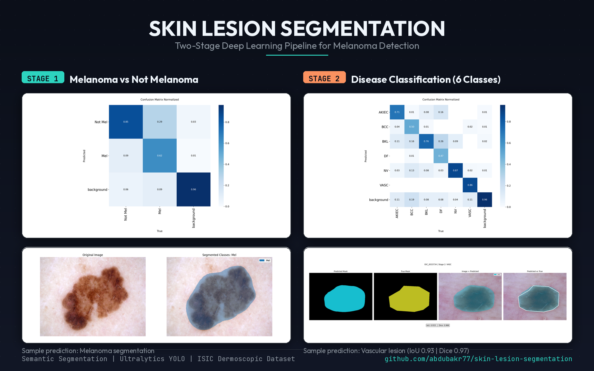
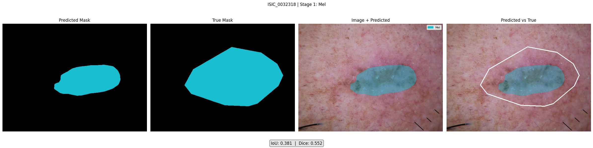

<div align="center">

# Skin Lesion Segmentation

A two stage deep learning pipeline that first detects melanoma versus non melanoma lesions, then classifies the specific skin disease for non melanoma cases, using semantic segmentation on dermatological images.




</div>

## Table of Contents

- [Overview](#overview)
- [Why Two Stages](#why-two-stages)
- [Dataset](#dataset)
- [Project Structure](#project-structure)
- [Pipeline](#pipeline)
- [Augmentation Strategy](#augmentation-strategy)
- [Evaluation](#evaluation)
- [Inference Pipeline](#inference-pipeline)
- [Installation](#installation)
- [Usage](#usage)
- [Notebooks](#notebooks)
- [Tech Stack](#tech-stack)
- [Sample Results](#sample-results)
- [Roadmap](#roadmap)
- [License](#license)
- [Author](#author)

## Overview

Melanoma is the deadliest form of skin cancer, and early detection from dermatological photographs can make a real difference in patient outcomes. This project builds a semantic segmentation pipeline that:

1. Segments the lesion boundary in a skin image.
2. Decides whether the lesion is melanoma or not.
3. If not melanoma, routes the image to a second model that identifies which of several common skin conditions it actually is.

The pipeline is built end to end: raw mask preprocessing, polygon extraction and validation, dataset balancing through smart augmentation, model training with Ultralytics, and a full inference pipeline with ground truth comparison and evaluation statistics.

## Why Two Stages

The dataset is heavily imbalanced. Melanoma cases are a small minority compared to non melanoma lesions, and within the non melanoma group the class distribution across diseases (nevus, benign keratosis, basal cell carcinoma, actinic keratosis, vascular lesions, dermatofibroma) is uneven as well. Training a single model on all classes at once would let the majority classes dominate learning and hurt melanoma detection specifically, which is the most clinically important class.

Splitting the problem into two stages allows each model to specialize:

- Stage 1 focuses purely on the highest stakes decision: melanoma or not.
- Stage 2 only has to worry about differentiating between non melanoma conditions, which is a comparatively lower risk classification problem.

## Dataset

The dataset consists of dermoscopic images paired with segmentation masks and diagnosis labels, following a scheme similar to HAM10000 style skin lesion datasets.

- Raw data: original images, binary segmentation masks, and a metadata CSV with diagnosis (`dx`) and diagnosis confirmation method (`dx_type`).
- Processed data: two versions of the same lesions prepared for each stage.
  - Stage 1: binary classes, melanoma vs not melanoma.
  - Stage 2: multi class, covering the six non melanoma diagnoses (`nv`, `bkl`, `bcc`, `akiec`, `vasc`, `df`).

Each processed split (train, val, test) contains YOLO segmentation style label files, where every lesion is represented as one or more polygons with an associated class id.

## Project Structure

```
skin-lesion-segmentation/
├── data/
│   ├── raw/
│   │   ├── images/
│   │   ├── masks/
│   │   └── metadata.csv
│   └── processed/
│       ├── stage1/
│       │   ├── melanoma/{train,val,test}
│       │   └── not_melanoma/{train,val,test}
│       └── stage2/
│           └── {train,val,test}/{images,labels}
├── notebooks/
│   ├── 01_data_exploration.ipynb
│   ├── 02_preprocessing.ipynb
│   ├── 03_model_training.ipynb
│   ├── 04_evaluation.ipynb
│   └── 05_inference_pipeline.ipynb
├── src/
│   ├── data/
│   │   ├── dataset.py
│   │   ├── transforms.py
│   │   └── yolo_export.py
│   └── utils/
│       ├── metrics.py
│       ├── polygon_preprocessing.py
│       ├── polygon_validation.py
│       ├── visualization.py
│       ├── augmentation.py
│       ├── evaluation.py
│       ├── inference_io.py
│       ├── inference_visualization.py
│       └── inference_pipeline.py
├── outputs/
│   ├── checkpoints/
│   ├── predictions/
│   └── logs/
├── requirements.txt
├── .gitignore
└── README.md
```

## Pipeline

1. **Mask to polygon conversion.** Raw binary masks are converted into polygon annotations using contour detection, with a validation and repair step for invalid or self intersecting shapes, and a filter that removes tiny noise contours.
2. **Dataset splitting.** Data is split into train, validation, and test sets at the patient level (grouped by `lesion_id`) using multilabel stratified splitting, so the same lesion never leaks across splits.
3. **YOLO export.** Polygons and class ids are exported into YOLO segmentation label format, one folder per split, ready for training.
4. **Augmentation.** Underrepresented classes are boosted through targeted augmentation, described below.
5. **Training.** Both stages are trained as semantic segmentation models using Ultralytics, tracking cross entropy loss, Dice loss, mIoU, and pixel accuracy across epochs.
6. **Evaluation.** Training curves, confusion matrices, and metric comparisons between the two stages are reviewed in a dedicated notebook.
7. **Inference.** A cascading inference pipeline runs both models in sequence, compares predictions against ground truth when available, and organizes outputs for easy review.

## Augmentation Strategy

Beyond standard geometric and color augmentations (flips, rotation, brightness and contrast jitter, CLAHE, hue and saturation shifts), this project includes a custom augmentation designed specifically for dermoscopic images:

- **Hair overlay augmentation.** Real dermoscopic images often contain body hair crossing the lesion, which can confuse a model that has never seen it. Thin curved hair strands, extracted from reference images and simplified into smooth vector curves, are blended onto training images at random positions, angles, and scales using alpha blending rather than hard masking, so they look natural rather than like pasted graphics.
- **Class aware copy count.** Instead of augmenting every image the same number of times, the pipeline counts how many label instances exist per class and computes how many augmented copies each image needs so that rare classes (such as melanoma in stage 1, or dermatofibroma and vascular lesions in stage 2) get closer to the volume of the majority class.

## Evaluation

The evaluation notebook loads the `results.csv` produced during training for each stage and provides:

- Train versus validation curves for loss and Dice loss.
- A bar chart comparing mIoU between Stage 1 and Stage 2.
- A bar chart comparing pixel accuracy between the two stages.
- Confusion matrices and result plots saved automatically during training.

## Inference Pipeline

The inference pipeline in `05_inference_pipeline.ipynb` runs both stages together as a cascade:

- Accepts a single image, a list of specific images, or an entire folder.
- Optionally compares predictions against ground truth, either from raw segmentation masks or from YOLO label files.
- Automatically separates images where a model failed to detect anything into clearly labeled folders, so it is easy to see which stage struggled and on which images.
- Produces a four panel comparison per image: the predicted mask alone, the true mask alone, the image with the predicted mask overlaid, and the image with both predicted and true masks overlaid together with IoU and Dice scores.
- Saves cropped lesion images for further analysis.
- Aggregates everything into a results DataFrame and a statistics summary covering detection rates, classification accuracy, and mean IoU and Dice across the processed set.

## Installation

```bash
git clone https://github.com/abdubakr77/skin-lesion-segmentation.git
cd skin-lesion-segmentation
pip install -r requirements.txt
```

## Usage

Run the notebooks in order from the `notebooks/` folder:

```
01_data_exploration.ipynb      Explore class balance, image resolutions, and sample lesions
02_preprocessing.ipynb         Convert masks to polygons, split the dataset, export to YOLO format
03_model_training.ipynb        Train Stage 1 and Stage 2 models
04_evaluation.ipynb            Compare training metrics between stages
05_inference_pipeline.ipynb    Run the full two stage inference pipeline
```

## Notebooks

| Notebook | Purpose |
|---|---|
| `01_data_exploration.ipynb` | Dataset statistics and visual inspection |
| `02_preprocessing.ipynb` | Polygon extraction, validation, splitting, YOLO export |
| `03_model_training.ipynb` | Training configuration and execution for both stages |
| `04_evaluation.ipynb` | Metric curves, confusion matrices, stage comparison |
| `05_inference_pipeline.ipynb` | End to end two stage inference with ground truth comparison |

## Tech Stack

- Python
- Ultralytics (semantic segmentation)
- OpenCV
- Shapely
- Albumentations
- Pandas and NumPy
- Matplotlib
- Scikit learn and iterative stratification

## Sample Results



## Roadmap

- [ ] Expand Stage 2 to include additional rare disease classes as more data becomes available.
- [ ] Experiment with instance level segmentation for overlapping lesions.
- [ ] Package the two stage pipeline behind a simple web interface for quick testing.

## License

This project is released under the MIT License. The dataset follows the license terms of its original source.

## Author

**Abdullah Bakr**
AI/ML Engineering Student

- GitHub: [@abdubakr77](https://github.com/abdubakr77)
- LinkedIn: [abdubakr](https://linkedin.com/in/abdubakr)
- Kaggle: [abdullahbakr7](https://kaggle.com/abdullahbakr7)
- Portfolio: [abdubakr77.github.io](https://abdubakr77.github.io)